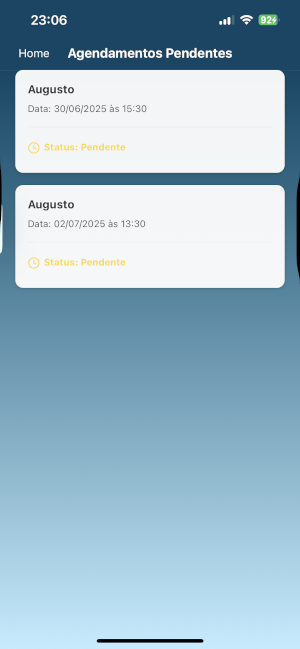
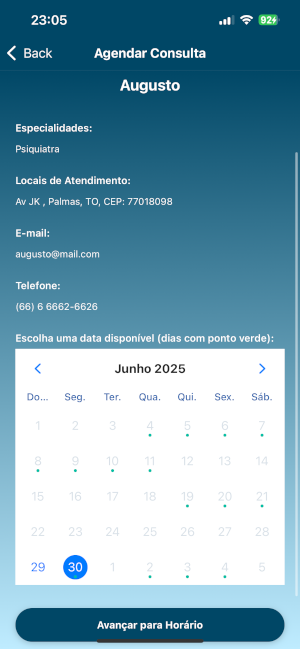

 # Projeto de Sistemas 2025.1 - Universidade Federal do Tocantins
 Bacharelado em Ciência da Computação,  
 
 Professor: Edeilson Milhomem da Silva  

 Grupo: Henrique Noronha, Vicente, Breno Borges, João Victor Mota e Igor.

## MedFinder
### Descrição 

O **MedFinder** é uma plataforma digital inovadora que conecta pacientes a serviços de saúde de forma rápida e eficiente. O sistema permite que os usuários encontrem **clínicas médicas, laboratórios, fisioterapeutas, nutricionistas, dentistas e outros profissionais da área**, com base em especialidade, localização e convênio. Além disso, possibilita o **agendamento de consultas e exames** de maneira prática e online.

Para profissionais e estabelecimentos de saúde, o **MedFinder** oferece um espaço dedicado para a **divulgação de serviços**, aumentando a visibilidade e facilitando a captação de novos pacientes. Com um modelo de monetização baseado em **planos pagos e publicidade**, a plataforma busca se tornar uma solução sustentável e escalável dentro do mercado da saúde.

---

## MVP - MedFinder
O MVP (Minimum Viable Product) do MedFinder será uma versão funcional da plataforma focada nas principais funcionalidades essenciais para validar a proposta de valor e testar a aceitação do mercado.

### Funcionalidades Essenciais:
- Como usuário:
    - Cadastro de Usuários
    - Busca e Filtros 
    - Agendamento online
    - Histórico de consultas
- Como Administrador:
    - Profissionais recebem notificação dos novos agendamentos.
    - Gerenciar agenda e disponibilidade.
    - Modelo de Monetização

---

## Tecnologias Utilizadas

---

## User Stories e Protótipos de Tela 

 ### Página de Boas-vindas MedFinder: 

  

 ### Cadastro e Login:  
 Como usuário quero me cadastrar e fazer login na plataforma para acessar os serviços de saúde disponíveis. Para realizar o login é necessário ter feito o cadastro e preencher o email e senha, caso contrário, clicar em "Não possui cadastro?"  

    

 ### Tela Inicial do Usuário  

 Como usuário, após fazer o login, consigo visualizar o campo de pesquisa, além de cards como: histórico, pendências, resultados e ajuda.  

 
 

**Critérios de Aceitação**  

-  O usuário deve visualizar um campo de busca para pesquisar por especialidade médica.  
-  O campo de busca deve permitir a digitação de termos.  
-  O botão de pesquisa deve estar visível e acessível para iniciar a busca.  
-  O usuário deve ver quatro opções de navegação: **Histórico**, **Pendentes**, **Ajuda** e **Resultados**.  
-  Ao clicar em **Histórico**, o usuário é direcionado para uma tela com consultas passadas.  
-  Ao clicar em **Pendentes**, o usuário é direcionado para uma tela com consultas e exames ainda não realizados.  
-  Ao clicar em **Ajuda**, o usuário acessa informações sobre como usar o aplicativo.  
-  Ao clicar em **Resultados**, o usuário visualiza seus exames disponíveis na plataforma.  
-  O usuário deve ver seu nome ou um avatar no canto superior direito da tela.    

**Cenários de Uso**

 Cenário 1: Busca por um profissional
- O usuário digita "Cardiologista" no campo de busca.
- Clica no botão de pesquisa.
- O sistema exibe uma lista de profissionais disponíveis.

 Cenário 2: Visualização do histórico de consultas
- O usuário clica no botão "Histórico".
- O sistema exibe uma lista de consultas passadas.

 Cenário 3: Ver agendamentos pendentes
- O usuário clica no botão "Pendentes".
- O sistema exibe consultas e exames ainda não realizados.

 Cenário 4: Acesso a exames disponíveis
- O usuário clica no botão "Resultados".
- O sistema exibe os exames já disponibilizados pelos laboratórios.  

### Histórico, pendentes e resultados.  
Como usuário, quero verificar meu histórico, minhas pendencias e os resultados dos meus exames.  
Para isso haverá cards na tela inicial, que ao clicar redirecionará para as respectivas páginas.   

    

**Critérios de Aceitação**    
-  Permitir visualizar o **histórico** de consultas já concluídas, com botão "detalhes" para expansão. 
-  Exibir uma lista de **agendamentos pendentes** com data e horário, além dos botões "detalhes" e "cancelar".    
-  Mostrar **resultados** das consultas passadas, com botão "detalhes" para expansão.   

### Pesquisa  
Como **usuário**, quero pesquisar profissionais e serviços da saúde podendo visualizar uma lista de resultados, podendo clicar em um profissional ou serviço para abrir uma nova página e realizar o agendamento.  

    

**Critérios de Aceitação**  
-  Permitir que o usuário pesquise por profissionais com filtros disponíveis.  
-  Exibir uma lista de profissionais com nome, local de atendimento e foto se houver.  
-  Incluir um botão ou link em cada profissional para acessar a página de agendamento.  
-  Redirecionar o usuário para a página do profissional selecionado ao clicar.  

### Agendamentos  
Como usuário, quero que, ao clicar em um profissional, seja aberta uma aba contendo um calendário e um botão 'Ver Detalhes', para que eu possa selecionar uma data disponível e visualizar informações detalhadas do agendamento.  

   

 **Critérios de Aceitação**
-  Ao clicar em um profissional na lista, o sistema deve abrir uma nova aba com um calendário.
-  O calendário deve exibir as datas disponíveis para agendamento.
-  Deve haver um botão "Ver Detalhes" para data e horário disponível.
-  Ao clicar em "Ver Detalhes", o sistema deve exibir informações adicionais (ex: horário da consulta, duração, observações, etc.).
-  A interface deve ser intuitiva e responsiva para facilitar a seleção da data e visualização dos detalhes.

## Planejamento de Iterações
### Iteração 1: Cadastro, login e edição de perfil  
Nesta primeira iteração, serão implementadas as funcionalidades essenciais para cadastro e login dos usuários.  

**Requisitos Funcionais**  

| Nº | Requisito             | Tela | Funcionalidade | Autor    | Revisor  |
|----|------------------------|------|----------------|----------|----------|
| 1  | Tela de Boas-vindas    |      |                | Henrique | Vicente  |
| 2  | Cadastro de Usuário    |      |                | Breno    | João     |
| 3  | Login de Usuário       |      |                | Igor     | Henrique |
| 4  | Tela Home              |      |                | Vicente  | Breno    |
| 5  | Editar Perfil          |      |                | João     | Igor     |
  

Objetivo: Como usuário quero poder me cadastrar na plataforma, fazer o login e editar meus dados.  

### Links Úteis: 
[Canvas Model](https://www.canva.com/design/DAGieJYwx_A/xZMhdLHK27y2-sjlAGdxYA/edit?utm_content=DAGieJYwx_A&utm_campaign=designshare&utm_medium=link2&utm_source=sharebutton)  
[Plano de Negócio](https://drive.google.com/file/d/1AQET8fuBe_vVqDHvAbeuwbzvECn_IEVi/view?usp=sharing)  
[Prototipação](https://www.figma.com/design/ox6mAwSthgpXY2brCMVVpa/MedFinder?node-id=0-1&t=Epe7rgLvOBSERP3l-1)