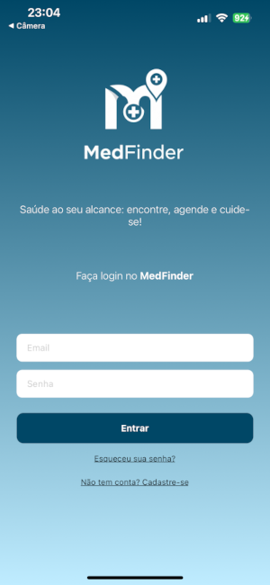

## User Stories e Protótipos de Tela
 

 ### Cadastro e Login:  
 Como usuário quero me cadastrar e fazer login na plataforma para acessar os serviços de saúde disponíveis. Para realizar o login é necessário ter feito o cadastro e preencher o email e senha, caso contrário, clicar em "Não possui cadastro?"  

    

 ### Tela Inicial do Usuário  

 Como usuário, após fazer o login, consigo visualizar o campo de pesquisa, além de cards como: histórico, pendências, resultados e ajuda.  

 
 

**Critérios de Aceitação**  

-  O usuário deve visualizar um campo de busca para pesquisar por especialidade médica.  
-  O campo de busca deve permitir a digitação de termos.  
-  O botão de pesquisa deve estar visível e acessível para iniciar a busca.  
-  O usuário deve ver quatro opções de navegação: **Histórico**, **Pendentes**, **Ajuda** e **Resultados**.  
-  Ao clicar em **Histórico**, o usuário é direcionado para uma tela com consultas passadas.  
-  Ao clicar em **Pendentes**, o usuário é direcionado para uma tela com consultas e exames ainda não realizados.  
-  Ao clicar em **Ajuda**, o usuário acessa informações sobre como usar o aplicativo.  
-  Ao clicar em **Resultados**, o usuário visualiza seus exames disponíveis na plataforma.  
-  O usuário deve ver seu nome ou um avatar no canto superior direito da tela.    

**Cenários de Uso**

 Cenário 1: Busca por um profissional
- O usuário digita "Cardiologista" no campo de busca.
- Clica no botão de pesquisa.
- O sistema exibe uma lista de profissionais disponíveis.

 Cenário 2: Visualização do histórico de consultas
- O usuário clica no botão "Histórico".
- O sistema exibe uma lista de consultas passadas.

 Cenário 3: Ver agendamentos pendentes
- O usuário clica no botão "Pendentes".
- O sistema exibe consultas e exames ainda não realizados.

 Cenário 4: Acesso a exames disponíveis
- O usuário clica no botão "Resultados".
- O sistema exibe os exames já disponibilizados pelos laboratórios.  

### Histórico, pendentes e resultados.  
Como usuário, quero verificar meu histórico, minhas pendencias e os resultados dos meus exames.  
Para isso haverá cards na tela inicial, que ao clicar redirecionará para as respectivas páginas.  

    

**Critérios de Aceitação**    
-  Permitir visualizar o **histórico** de consultas já concluídas, com botão "detalhes" para expansão.
-  Exibir uma lista de **agendamentos pendentes** com data e horário, além dos botões "detalhes" e "cancelar".    
-  Mostrar **resultados** das consultas passadas, com botão "detalhes" para expansão.  

### Pesquisa  
Como **usuário**, quero pesquisar profissionais e serviços da saúde podendo visualizar uma lista de resultados, podendo clicar em um profissional ou serviço para abrir uma nova página e realizar o agendamento.  

    

**Critérios de Aceitação**  
-  Permitir que o usuário pesquise por profissionais com filtros disponíveis.  
-  Exibir uma lista de profissionais com nome, local de atendimento e foto se houver.  
-  Incluir um botão ou link em cada profissional para acessar a página de agendamento.  
-  Redirecionar o usuário para a página do profissional selecionado ao clicar.  

### Agendamentos  
Como usuário, quero que, ao clicar em um profissional, seja aberta uma aba contendo um calendário e um botão 'Ver Detalhes', para que eu possa selecionar uma data disponível e visualizar informações detalhadas do agendamento.  

   

 **Critérios de Aceitação**
-  Ao clicar em um profissional na lista, o sistema deve abrir uma nova aba com um calendário.
-  O calendário deve exibir as datas disponíveis para agendamento.
-  Deve haver um botão "Ver Detalhes" para data e horário disponível.
-  Ao clicar em "Ver Detalhes", o sistema deve exibir informações adicionais (ex: horário da consulta, duração, observações, etc.).
-  A interface deve ser intuitiva e responsiva para facilitar a seleção da data e visualização dos detalhes.  

### Tela Inicial do Profissional

Como um **profissional de saúde**, após fazer o login, quero visualizar um painel central com acesso rápido às minhas principais tarefas, para que eu possa gerenciar minha agenda e atividades de forma eficiente.

**Critérios de Aceitação**
-   Deve exibir uma mensagem de boas-vindas personalizada com o nome do profissional (ex: "Seja bem-vindo, Dr(a). Augusto!").
-   Deve haver quatro cards de navegação principais: **Histórico**, **Pendentes**, **Definir Horários** e **Enviar Resultados**.
-   Ao clicar em **Pendentes**, o profissional é direcionado para a tela de gerenciamento de solicitações de agendamento.
-   Ao clicar em **Definir Horários**, o profissional é direcionado para a tela com o calendário para gerenciar sua disponibilidade.
-   Deve haver ícones visíveis para **Logout**, acesso ao **Perfil** e **Notificações** no cabeçalho.

**Cenários de Uso**

*Cenário 1: Ver novas solicitações de consulta*
- O profissional faz login e visualiza o painel.
- Clica no card "Pendentes".
- O sistema exibe a lista de agendamentos que aguardam confirmação.

*Cenário 2: Atualizar a agenda da próxima semana*
- O profissional faz login e visualiza o painel.
- Clica no card "Definir Horários".
- O sistema exibe o calendário para que ele possa adicionar ou remover horários de atendimento.

### Definir Disponibilidade do Profissional

Como um **profissional de saúde**, quero selecionar datas em um calendário e marcar os horários específicos em que estou disponível para atendimento, para que os pacientes possam agendar consultas apenas nos meus horários vagos.

**Critérios de Aceitação**
-   A tela deve exibir um calendário interativo.
-   Os dias em que o profissional já definiu alguma disponibilidade devem ser visualmente destacados (ex: com um ponto verde).
-   Ao selecionar um dia no calendário, deve ser exibida uma grade de horários pré-definidos (ex: 08:00, 08:30, etc.).
-   O profissional deve poder clicar para selecionar/desselecionar múltiplos horários para o dia escolhido.
-   Os horários selecionados devem ter um destaque visual diferente dos não selecionados.
-   Um botão "Salvar" deve permitir persistir as alterações de horários para a data selecionada no banco de dados.

**Cenários de Uso**

*Cenário 1: Adicionar disponibilidade para um novo dia*
- O profissional seleciona uma data futura no calendário.
- Clica nos horários desejados (ex: 14:00, 14:30, 15:00).
- Clica em "Salvar".
- A data no calendário agora aparece marcada como um dia com disponibilidade.

*Cenário 2: Remover disponibilidade de um dia*
- O profissional seleciona um dia já configurado.
- Desmarca todos os horários que estavam selecionados.
- Clica em "Salvar".
- A marcação visual de disponibilidade (ponto verde) desaparece daquele dia no calendário.

### Gerenciar Agendamentos Pendentes (Visão do Profissional)

Como um **profissional de saúde**, quero ver uma lista de todas as solicitações de agendamento que ainda não respondi, para que eu possa confirmar ou recusar cada solicitação e manter minha agenda organizada.

**Critérios de Aceitação**
-   A tela deve listar todos os agendamentos com o status "Pendente".
-   Cada item da lista (cada card) deve exibir o nome do paciente, a data e o horário solicitados.
-   Cada item deve ter um botão "Confirmar".
-   Cada item deve ter um botão "Recusar".
-   Ao clicar em "Confirmar", o status do agendamento deve ser atualizado para "confirmada" no banco de dados e o paciente deve ser notificado.
-   Ao clicar em "Recusar", o status do agendamento deve ser atualizado para "cancelada" e o paciente deve ser notificado.
-   Após uma ação (Confirmar/Recusar), o item deve ser removido da lista de pendências.

**Cenários de Uso**

*Cenário 1: Confirmar uma consulta*
- O profissional revisa uma solicitação e verifica que tem disponibilidade.
- Clica no botão "Confirmar".
- A solicitação some da tela e o paciente recebe uma notificação de confirmação.

*Cenário 2: Recusar uma consulta*
- O profissional percebe um conflito de horários para uma solicitação.
- Clica no botão "Recusar".
- A solicitação some da tela e o paciente recebe uma notificação de que a consulta foi recusada.
